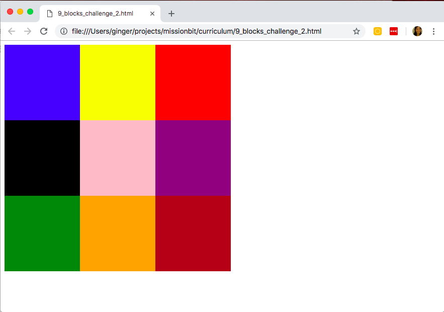

# 9 Blocks Challenge - Part II

Now you should have a grid similar to this one:

The next step is to re-create this same grid using the 3 different ways to add CSS: Inline, Internal Stylesheet, and External Stylesheet.

### What's the point?

Now that you have successfully used CSS to create 9 beautifully colored squares organized into a grid, it's helpful to practice doing the same task in different ways.

It's important to understand not only that you can add  CSS to an HTML page, but also how to do it, and what are the pros and cons of each method.

This exercise will help you experience first hand some of these pros and cons.

### Challenge - Part II:

1. Create the same 9 blocks using a different way of adding CSS to your HTML page. For example, if you used inline style for the first part, now create a new document and try doing the same thing but using an internal style sheet.
2. Finally, create the same 9 blocks using an external style sheet.

__Be patient with yourself.__ This is supposed to be a challenge.

If you are feeling lost, review Module 3, part 3.

__Hint:__
1. Which way did you create your grid? If you used inline CSS, do you see anything that repeats over and over again? Repeated style might be an indication that you need to use a [class selector](https://www.w3schools.com/css/css_syntax.asp).

